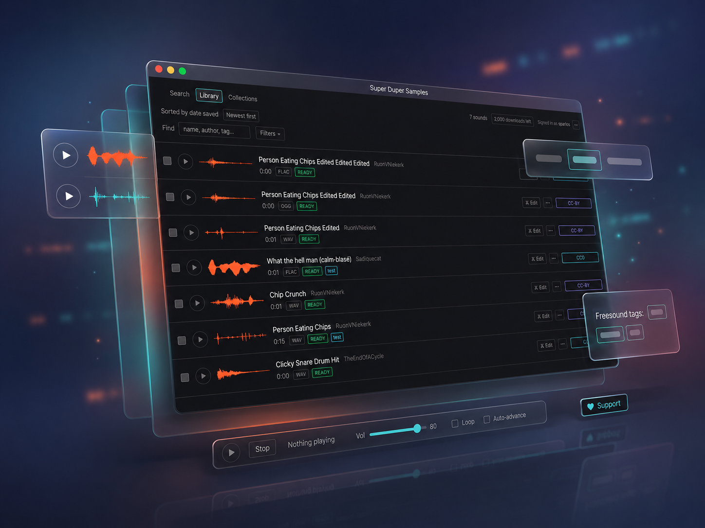

# Super Duper Samples

A desktop client for [Freesound](https://freesound.org) built for people scoring to
picture or producing music: search the library, audition previews, download originals
against your own Freesound account, keep a local library, and **drag sounds straight
into your DAW**. It also generates a credits/attribution manifest for a set of sounds
and does light trim-and-export edits.



## Status

This is source you build and run yourself. There is **no bundled API key**: every
Freesound call — search included — uses the signed-in user's OAuth2 token (see
[ADR-0004](docs/adr/0004-server-side-token-exchange.md)), which means you must

1. register your own Freesound API application, and
2. deploy your own token-exchange Cloudflare Worker (it holds the OAuth
   `client_secret`; the app never does).

Full instructions are in [SETUP.md](SETUP.md). Prebuilt installers exist
([release workflow](.github/workflows/release.yml)) but are **unsigned** and will not
sign in unless a Worker is deployed and its URL baked into the build — see
[INSTALL.md](INSTALL.md) and [ADR-0007](docs/adr/0007-ship-unsigned-no-auto-update.md).

## Develop

```sh
pnpm install
cp apps/desktop/.env.example apps/desktop/.env   # then fill in per SETUP.md
pnpm --filter @superduper/desktop dev            # hot reload, main + renderer
pnpm -r test                                     # Vitest, no Electron
pnpm -r typecheck
```

- **pnpm** workspace, **Node 24**, **TypeScript** `strict`, **Vitest**.
- `apps/desktop` — the Electron app (electron-vite).
- `worker` — the stateless Cloudflare Worker that does the OAuth token exchange.

## Architecture

The rule the codebase is organised around: *if a behaviour can't be exercised without
launching Electron, it's in the wrong place.*

| Layer | Directory | Role |
|---|---|---|
| Core | `apps/desktop/src/core/` | Plain Node module. All behaviour. No `electron` import, ever. |
| Gateway | `apps/desktop/src/core/gateway/` | The sole network boundary to Freesound. |
| Main | `apps/desktop/src/main/` | Thin Electron adapter — constructs the core, forwards its command API over IPC. No business logic. |
| Preload | `apps/desktop/src/preload/` | `contextBridge` surface. `contextIsolation`, `sandbox`, no `nodeIntegration`. |
| Renderer | `apps/desktop/src/renderer/` | React + Tailwind. Presentation only. Reaches the core through `window.core`. |

Terminology is defined in [CONTEXT.md](CONTEXT.md); repo conventions in
[CONVENTIONS.md](CONVENTIONS.md); design decisions in [docs/adr/](docs/adr/).

## License

[MIT](LICENSE) — © 2026 Super Duper Software. Sounds fetched from Freesound carry
their own Creative Commons licenses; the app records them and generates attribution.
